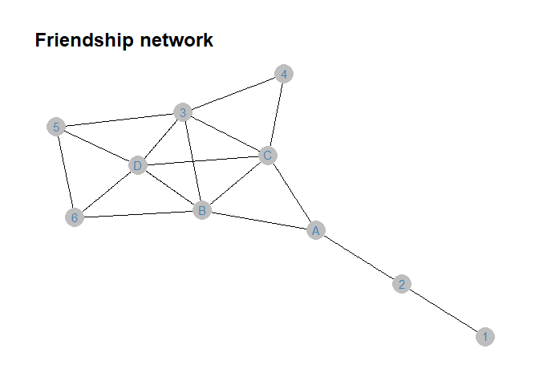
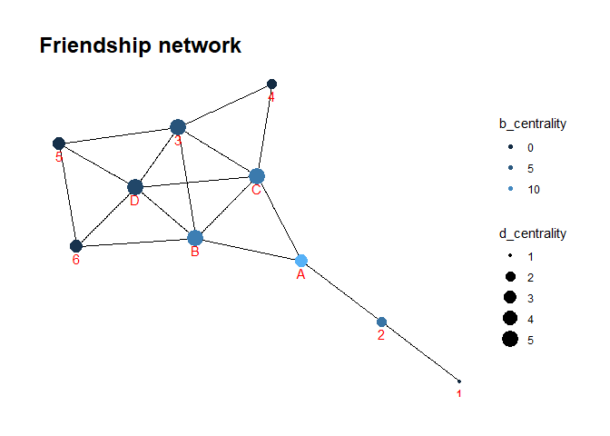

Exercise 4 - Ranvir Kumar
================

## Illustration of friendship network

We’ll use `tidygraph` package to create and plot the friendship network
from the slides. The nodes are Abby (A), Becca (B), Chloe (C) and Deb
(D). Abby is only friends with Becca; Becca is friends with Abby, Chloe
and Deb; and Chloe and Deb and friends with Becca and each other (but
not Abby).

We’ll be relying on these tutorials:

-   <http://users.dimi.uniud.it/~massimo.franceschet/ns/syllabus/make/tidygraph/tidygraph.html>
-   <https://www.data-imaginist.com/2017/introducing-tidygraph/>
-   <https://www.data-imaginist.com/2018/tidygraph-1-1-a-tidy-hope/>

First, we define the network by manually entering all the nodes and the
connections between them. We’ll define `nodes` table that has two
columns: `id` and `name`. We will then define the connections among them
as an edgelist, where each element in column `from` corresponds to a
friend on one end of the relationship and each element in column `to`
corresponds to the person on the other end of this friendship tie.

``` r
# define nodes
node_names <- tibble(
  id   = c(1,2,3,4,5,6,7,8,9,10),
  name = c("1","2","3","4","5","6","A","B","C","D")
)
node_names
```

    ## # A tibble: 10 × 2
    ##       id name 
    ##    <dbl> <chr>
    ##  1     1 1    
    ##  2     2 2    
    ##  3     3 3    
    ##  4     4 4    
    ##  5     5 5    
    ##  6     6 6    
    ##  7     7 A    
    ##  8     8 B    
    ##  9     9 C    
    ## 10    10 D

``` r
# define connections (have to correspond to ties 1-2, 2-3, 2-4, 3-4)
# for each element in `from` there is a corresponding element in `to`
edge_list <- tibble(
  from = c(1,2,7,7,8,8,8,8,9,9,9,10,10,10,3,3,5),
  to   = c(2,7,8,9,9,10,3,6,10,3,4,3,6,5,5,4,6)
)
edge_list
```

    ## # A tibble: 17 × 2
    ##     from    to
    ##    <dbl> <dbl>
    ##  1     1     2
    ##  2     2     7
    ##  3     7     8
    ##  4     7     9
    ##  5     8     9
    ##  6     8    10
    ##  7     8     3
    ##  8     8     6
    ##  9     9    10
    ## 10     9     3
    ## 11     9     4
    ## 12    10     3
    ## 13    10     6
    ## 14    10     5
    ## 15     3     5
    ## 16     3     4
    ## 17     5     6

We can now combine these tables into a “graph” object that holds all of
our network data.

``` r
# combine this information into a network graph object
friendship_graph <- tbl_graph(nodes = node_names, edges = edge_list, directed = FALSE)
friendship_graph
```

    ## # A tbl_graph: 10 nodes and 17 edges
    ## #
    ## # An undirected simple graph with 1 component
    ## #
    ## # Node Data: 10 × 2 (active)
    ##      id name 
    ##   <dbl> <chr>
    ## 1     1 1    
    ## 2     2 2    
    ## 3     3 3    
    ## 4     4 4    
    ## 5     5 5    
    ## 6     6 6    
    ## # … with 4 more rows
    ## #
    ## # Edge Data: 17 × 2
    ##    from    to
    ##   <int> <int>
    ## 1     1     2
    ## 2     2     7
    ## 3     7     8
    ## # … with 14 more rows

We can now plot this network using `ggraph` package.

``` r
friendship_graph %>% 
    ggraph(layout = 'kk') + 
    geom_edge_link() + 
    geom_node_point(size = 8, colour = 'gray') +
    geom_node_text(aes(label = name), colour = 'steelblue', vjust = 0.4) + 
    ggtitle('Friendship network') + 
    theme_graph()
```

    ## Warning in grid.Call(C_stringMetric, as.graphicsAnnot(x$label)): font family not
    ## found in Windows font database

    ## Warning in grid.Call(C_textBounds, as.graphicsAnnot(x$label), x$x, x$y, : font
    ## family not found in Windows font database

    ## Warning in grid.Call(C_textBounds, as.graphicsAnnot(x$label), x$x, x$y, : font
    ## family not found in Windows font database

<!-- -->

We can use many of the functions in package `tidy_graph` to calculate
things we want to know about this network. For example, we may want to
know the centrality of each node in the network.

``` r
friendship_graph <- friendship_graph %>% 
  activate(nodes) %>% # we need to state we'll be adding to nodes, not edges
  mutate(d_centrality = centrality_degree()) %>%  # adding measure of degree centrality
  mutate(b_centrality = centrality_betweenness()) # adding betweenness centrality
```

    ## Warning in betweenness(graph = graph, v = V(graph), directed = directed, :
    ## 'nobigint' is deprecated since igraph 1.3 and will be removed in igraph 1.4

``` r
friendship_graph
```

    ## # A tbl_graph: 10 nodes and 17 edges
    ## #
    ## # An undirected simple graph with 1 component
    ## #
    ## # Node Data: 10 × 4 (active)
    ##      id name  d_centrality b_centrality
    ##   <dbl> <chr>        <dbl>        <dbl>
    ## 1     1 1                1        0    
    ## 2     2 2                2        8    
    ## 3     3 3                5        4.63 
    ## 4     4 4                2        0    
    ## 5     5 5                3        0.533
    ## 6     6 6                3        0.933
    ## # … with 4 more rows
    ## #
    ## # Edge Data: 17 × 2
    ##    from    to
    ##   <int> <int>
    ## 1     1     2
    ## 2     2     7
    ## 3     7     8
    ## # … with 14 more rows

Now let’s plot this with degree centrality determining the size of the
nodes and betweenness determining its color.

``` r
friendship_graph %>% 
  ggraph(layout = 'kk') + 
  geom_edge_link() + 
  geom_node_point(aes(size = d_centrality, colour = b_centrality)) + 
  scale_color_continuous(guide = 'legend') +
  geom_node_text(aes(label = name), colour = 'red', vjust = 1.6) + 
  ggtitle('Friendship network') + 
  theme_graph()
```

    ## Warning in grid.Call(C_stringMetric, as.graphicsAnnot(x$label)): font family not
    ## found in Windows font database

    ## Warning in grid.Call(C_stringMetric, as.graphicsAnnot(x$label)): font family not
    ## found in Windows font database

    ## Warning in grid.Call(C_textBounds, as.graphicsAnnot(x$label), x$x, x$y, : font
    ## family not found in Windows font database

    ## Warning in grid.Call(C_textBounds, as.graphicsAnnot(x$label), x$x, x$y, : font
    ## family not found in Windows font database

    ## Warning in grid.Call(C_textBounds, as.graphicsAnnot(x$label), x$x, x$y, : font
    ## family not found in Windows font database

    ## Warning in grid.Call(C_textBounds, as.graphicsAnnot(x$label), x$x, x$y, : font
    ## family not found in Windows font database

    ## Warning in grid.Call(C_textBounds, as.graphicsAnnot(x$label), x$x, x$y, : font
    ## family not found in Windows font database

    ## Warning in grid.Call(C_textBounds, as.graphicsAnnot(x$label), x$x, x$y, : font
    ## family not found in Windows font database

    ## Warning in grid.Call(C_textBounds, as.graphicsAnnot(x$label), x$x, x$y, : font
    ## family not found in Windows font database

    ## Warning in grid.Call(C_textBounds, as.graphicsAnnot(x$label), x$x, x$y, : font
    ## family not found in Windows font database

<!-- -->

## Results

### 1) Out of seats A, B, C & D, the seats with the highest degree centrality are B, C, and D. This means that all three seats B, C & D have the same density of ties to others (connected to the same number of people), in this case 5 people.

### 2) Out of the seats B, C & D, the seat B has the highest betweenness centrality, in this case 9.03. This means that out of the three seats with the hightest degree centrality, seat B has the highest bottleneck (most important seat in terms of connectivity to other people)

### 3) Hence, my choice of seat in this scenario would be seat B.

### 4) It is important to consider that seat A has the absolute maximum betweenness centrality of 14. This means that if being an important person in the room (i.e the person that people rely on to get information) is the most important criteria, rather than having the most number of friends (most number of connections), then seat A might as well be the best choice.

### 5) If having the most number of friends is important and nothing else, then either seat B, C or D would suffice.

### 6) If both having most friends and being a person that people rely on to get information are important, then seat B is by far the best choice in this scenario.

### Contributors to the code:

#### Ranvir, Liz and Patrick
