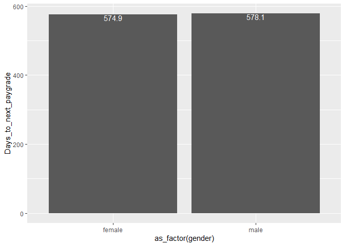

Exercise 5 - Ranvir K
================

## 0. Loading data and preparing variables

Here, I’m using the steps from exercise 2 example to create the
necessary variables.

``` r
# set path for R to find our data
data_path <- "C:/Users/rkjg9/OneDrive/RAZER Desktop Backup/MBA/Summer 2022/ORGB 690 - People Analytics/Group Project/USPTO_data/"
library(arrow) # to be able to load data in the .parquet format
```

    ## 
    ## Attaching package: 'arrow'

    ## The following object is masked from 'package:utils':
    ## 
    ##     timestamp

``` r
# read application data
app_data_sample <- read_parquet(paste0(data_path,"app_data_sample.parquet"))
library(gender)
#install_genderdata_package() # only run this line the first time you use the package, to get data for it
# get a list of first names without repetitions
examiner_names <- app_data_sample %>% 
  distinct(examiner_name_first)
examiner_names_gender <- examiner_names %>% 
  do(results = gender(.$examiner_name_first, method = "ssa")) %>% 
  unnest(cols = c(results), keep_empty = TRUE) %>% 
  select(
    examiner_name_first = name,
    gender,
    proportion_female
  )
# remove extra colums from the gender table
examiner_names_gender <- examiner_names_gender %>% 
  select(examiner_name_first, gender)
# joining gender back to the dataset
app_data_sample <- app_data_sample %>% 
  left_join(examiner_names_gender, by = "examiner_name_first")
# cleaning up
rm(examiner_names)
rm(examiner_names_gender)
gc()
```

    ##            used  (Mb) gc trigger  (Mb) max used  (Mb)
    ## Ncells  4520038 241.4    7984070 426.4  4540019 242.5
    ## Vcells 49472077 377.5   95377510 727.7 79787820 608.8

``` r
# Examiners' race
library(wru)
examiner_surnames <- app_data_sample %>% 
  select(surname = examiner_name_last) %>% 
  distinct()
examiner_race <- predict_race(voter.file = examiner_surnames, surname.only = T) %>% 
  as_tibble()
```

    ## [1] "Proceeding with surname-only predictions..."

    ## Warning in merge_surnames(voter.file): Probabilities were imputed for 698
    ## surnames that could not be matched to Census list.

``` r
examiner_race <- examiner_race %>% 
  mutate(max_race_p = pmax(pred.asi, pred.bla, pred.his, pred.oth, pred.whi)) %>% 
  mutate(race = case_when(
    max_race_p == pred.asi ~ "Asian",
    max_race_p == pred.bla ~ "black",
    max_race_p == pred.his ~ "Hispanic",
    max_race_p == pred.oth ~ "other",
    max_race_p == pred.whi ~ "white",
    TRUE ~ NA_character_
  ))
examiner_race <- examiner_race %>% 
  select(surname,race)
app_data_sample <- app_data_sample %>% 
  left_join(examiner_race, by = c("examiner_name_last" = "surname"))
rm(examiner_race)
rm(examiner_surnames)
gc()
```

    ##            used  (Mb) gc trigger  (Mb) max used  (Mb)
    ## Ncells  4934520 263.6    7984070 426.4  7984070 426.4
    ## Vcells 53270482 406.5   95377510 727.7 95165873 726.1

``` r
# Examiner's tenure
library(lubridate) # to work with dates
```

    ## 
    ## Attaching package: 'lubridate'

    ## The following object is masked from 'package:arrow':
    ## 
    ##     duration

    ## The following objects are masked from 'package:base':
    ## 
    ##     date, intersect, setdiff, union

``` r
examiner_dates <- app_data_sample %>% 
  select(examiner_id, filing_date, appl_status_date) 
examiner_dates <- examiner_dates %>% 
  mutate(start_date = ymd(filing_date), end_date = as_date(dmy_hms(appl_status_date))) %>% 
  filter(year(end_date)<2018) %>% 
  group_by(examiner_id) %>% 
  summarise(
    earliest_date = min(start_date, na.rm = TRUE), 
    latest_date = max(end_date, na.rm = TRUE),
    tenure_days = interval(earliest_date, latest_date) %/% days(1)
    )
app_data_sample <- app_data_sample %>% 
  left_join(examiner_dates, by = "examiner_id")
rm(examiner_dates)
gc()
```

    ##            used  (Mb) gc trigger   (Mb)  max used (Mb)
    ## Ncells  4949384 264.4   14342946  766.0  14342946  766
    ## Vcells 65650786 500.9  165103536 1259.7 137488974 1049

## Adding paygrade data

First, we load the paygrade file.

``` r
examiner_gs <- read_csv(paste0(data_path,"examiner_gs.csv"))
```

    ## Rows: 52109 Columns: 6
    ## ── Column specification ────────────────────────────────────────────────────────
    ## Delimiter: ","
    ## chr (3): examiner_name, start_date, end_date
    ## dbl (3): examiner_grade, old_pid, new_pid
    ## 
    ## ℹ Use `spec()` to retrieve the full column specification for this data.
    ## ℹ Specify the column types or set `show_col_types = FALSE` to quiet this message.

``` r
examiner_ids <- read_csv(paste0(data_path,"examiner_ids.csv"))
```

    ## Rows: 19454 Columns: 4
    ## ── Column specification ────────────────────────────────────────────────────────
    ## Delimiter: ","
    ## chr (1): examiner_name
    ## dbl (3): old_pid, new_pid, patex_id
    ## 
    ## ℹ Use `spec()` to retrieve the full column specification for this data.
    ## ℹ Specify the column types or set `show_col_types = FALSE` to quiet this message.

### We need to replace various IDs with examiner ID

The ID fields in the `examiner_gs.csv` file don’t match those in the
application data file. Because we’ll need to join these files later, we
need to bring in the proper ID field, by using the cross-walk file
`examiner_ids`.

``` r
examiner_gs <- examiner_gs %>% 
  left_join(examiner_ids) %>% 
  select(
    grade = examiner_grade,
    start_date,
    end_date,
    examiner_id = patex_id
  )
```

    ## Joining, by = c("examiner_name", "old_pid", "new_pid")

## Estimate time in grade

Now we need to estimate the average time each examiner spends in a given
GS paygrade. Note that the less-biased way to do that is to exclude the
latest or highest grade for each examiner. This is because after
examiners reach the highest grade (which is usually grade 14 in this
context), they cannot advance to the next grade. Imagine someone who
advances through grades 11, 12 and 13 in just 18 months (so, the average
for that examiner is 6 months per grade), but then stays in grade 14 and
works at the agency for another ten years. If you were to average all
grades, it would look like it took the examiner several years on average
to get promoted through each grade. This is because the last grade
biases the average positively.

Similarly, for examiners who get promoted right before the end of our
sample’s time window, the very short time they stay in the highest
observed grade will negatively bias the average. It will look like the
examiner has progressed through the grades way faster than she did.

``` r
time_in_grade <- examiner_gs %>% 
  mutate(
    start_date = mdy(start_date), # converting into proper date type
    end_date = mdy(end_date), # converting into proper date type
    days_in_grade = interval(start_date, end_date) %/% days(1)
  ) %>% 
  group_by(examiner_id) %>% 
  filter(grade!=max(grade, na.rm = TRUE)) %>% # dropping the highest grade record
  summarise(mean_days_in_grade = mean(days_in_grade, na.rm = TRUE))
time_in_grade
```

    ## # A tibble: 10,860 × 2
    ##    examiner_id mean_days_in_grade
    ##          <dbl>              <dbl>
    ##  1       59012               356.
    ##  2       59015               783 
    ##  3       59016               341.
    ##  4       59018               368.
    ##  5       59019               293 
    ##  6       59025               485 
    ##  7       59027               364.
    ##  8       59030               493.
    ##  9       59033               258.
    ## 10       59035               308.
    ## # … with 10,850 more rows

## Prepare application data

Let’s get the measure of application processing time for each examiner.
We’ll do this by “collapsing” the dataframe from application level to
examiner level (i.e., one record for each examiner, not multiple
records).

``` r
examiner_data <- app_data_sample %>% 
  filter(disposal_type!="PEND") %>% # here, we exclude in-process applications
  mutate(
    app_start_date = ymd(filing_date),
    app_end_date = case_when(
      disposal_type == "ISS" ~ ymd(patent_issue_date), # for issued patents
      disposal_type == "ABN" ~ ymd(abandon_date), # for abandoned applications
      TRUE ~ NA_Date_
    ),
    app_proc_days = interval(app_start_date, app_end_date) %/% days(1)) %>% 
  filter(app_proc_days>0 & app_proc_days < 3650) %>% # limit to 0-10 years
  group_by(examiner_id) %>% 
  summarise(
    app_count = n(),
    tc = min(tc, na.rm = TRUE),
    gender = first(gender),
    race = first(race),
    tenure_days = max(tenure_days, na.rm = TRUE),
    mean_app_proc_days = mean(app_proc_days, na.rm = TRUE)
  )
examiner_data
```

    ## # A tibble: 5,549 × 7
    ##    examiner_id app_count    tc gender race  tenure_days mean_app_proc_days
    ##          <dbl>     <int> <dbl> <chr>  <chr>       <dbl>              <dbl>
    ##  1       59012        84  1700 male   white        4013              1295.
    ##  2       59025        96  2400 male   Asian        2761              1152.
    ##  3       59030       358  2400 <NA>   black        4179              1008.
    ##  4       59040       233  1700 female Asian        3542              1305.
    ##  5       59052         8  2100 male   Asian        2017               535.
    ##  6       59054        10  2100 <NA>   Asian        5887              1297 
    ##  7       59055         2  2100 male   Asian        1149               932.
    ##  8       59056      1019  2100 male   Asian        6268              1077.
    ##  9       59074       166  2100 <NA>   white        6255              1579.
    ## 10       59081        48  2400 male   Asian        2220              1317.
    ## # … with 5,539 more rows

Now, let’s join in the time in grade data.

``` r
examiner_data <- examiner_data %>% 
  left_join(time_in_grade)
```

    ## Joining, by = "examiner_id"

``` r
examiner_data
```

    ## # A tibble: 5,549 × 8
    ##    examiner_id app_count    tc gender race  tenure_days mean_app_proc_days
    ##          <dbl>     <int> <dbl> <chr>  <chr>       <dbl>              <dbl>
    ##  1       59012        84  1700 male   white        4013              1295.
    ##  2       59025        96  2400 male   Asian        2761              1152.
    ##  3       59030       358  2400 <NA>   black        4179              1008.
    ##  4       59040       233  1700 female Asian        3542              1305.
    ##  5       59052         8  2100 male   Asian        2017               535.
    ##  6       59054        10  2100 <NA>   Asian        5887              1297 
    ##  7       59055         2  2100 male   Asian        1149               932.
    ##  8       59056      1019  2100 male   Asian        6268              1077.
    ##  9       59074       166  2100 <NA>   white        6255              1579.
    ## 10       59081        48  2400 male   Asian        2220              1317.
    ## # … with 5,539 more rows, and 1 more variable: mean_days_in_grade <dbl>

## Eliminating negative mean_days_in_grade

``` r
b_examiner_data = examiner_data %>% filter(examiner_data$mean_days_in_grade > 0)
```

## Calculating Mean days in grade based on Gender & race

``` r
gender_mean_advancement_time = b_examiner_data %>% group_by(gender) %>% 
  summarise(Days_to_next_paygrade = mean(mean_days_in_grade, na.rm = TRUE)) %>% filter(!is.na(gender))

ggplot(data = gender_mean_advancement_time, 
       mapping = aes(x = as_factor(gender), y = Days_to_next_paygrade)) + geom_bar(stat="identity")
```

<!-- -->

``` r
race_mean_advancement_time = b_examiner_data %>% group_by(race) %>% 
  summarise(Days_to_next_paygrade = mean(mean_days_in_grade, na.rm = TRUE))

ggplot(data = race_mean_advancement_time, mapping = aes(x = as_factor(race), 
                                                        y = Days_to_next_paygrade)) + 
  geom_bar(stat="identity")
```

<!-- -->

``` r
gen_race_mean_advancement_time = b_examiner_data %>% group_by(gender,race) %>% 
  summarise(Days_to_next_paygrade = mean(mean_days_in_grade, na.rm = TRUE)) %>% filter(!is.na(gender))
```

    ## `summarise()` has grouped output by 'gender'. You can override using the
    ## `.groups` argument.

``` r
ggplot(data = gen_race_mean_advancement_time, mapping = aes(x = as_factor(race), 
                                                            y = Days_to_next_paygrade, fill = as_factor(gender))) + 
  geom_bar(stat="identity",position = "dodge") + 
  geom_text(aes(label = round(Days_to_next_paygrade,1)),
            position = position_dodge(0.9), color="white",vjust = 1,hjust = 0.5)
```

<!-- --> \##
Plotting mean application prosecution time vs mean days in same paygrade

``` r
ggplot(b_examiner_data) +
  geom_point(
    aes(x=mean_app_proc_days, y = mean_days_in_grade), 
    )
```

<!-- -->

## Descriptive statistics and regressions

Let’s run a couple of simple regressions.

``` r
library(modelsummary)
models <- list()
models[['m1']] <- lm(mean_days_in_grade ~ 1 + mean_app_proc_days, data = b_examiner_data) 
models[['m2']] <- lm(mean_days_in_grade ~ 1 + mean_app_proc_days + as_factor(gender), 
         data = b_examiner_data) 
models[['m3']] <- lm(mean_days_in_grade ~ 1 + as_factor(gender), data = b_examiner_data)
models[['m4']] <- lm(mean_days_in_grade ~ 1 + as_factor(race), data = b_examiner_data) 
models[['m5']] <- lm(mean_days_in_grade ~ 1 + mean_app_proc_days + as_factor(race), 
         data = b_examiner_data) 


modelsummary(models)
```

|                         |     m1     |     m2     |     m3     |     m4     |     m5     |
|:------------------------|:----------:|:----------:|:----------:|:----------:|:----------:|
| (Intercept)             |  647.608   |  670.680   |  578.146   |  588.841   |  655.219   |
|                         |  (37.317)  |  (42.439)  |  (11.219)  |  (10.609)  |  (37.602)  |
| mean_app_proc_days      |   -0.059   |   -0.076   |            |            |   -0.055   |
|                         |  (0.030)   |  (0.033)   |            |            |  (0.030)   |
| as_factor(gender)female |            |   -6.187   |   -3.241   |            |            |
|                         |            |  (20.245)  |  (20.214)  |            |            |
| as_factor(race)Asian    |            |            |            |  -34.856   |  -32.737   |
|                         |            |            |            |  (18.282)  |  (18.313)  |
| as_factor(race)black    |            |            |            |   36.468   |   36.731   |
|                         |            |            |            |  (41.657)  |  (41.647)  |
| as_factor(race)Hispanic |            |            |            |  -79.213   |  -78.688   |
|                         |            |            |            |  (41.762)  |  (41.752)  |
| as_factor(race)other    |            |            |            |  -121.641  |  -113.297  |
|                         |            |            |            | (550.975)  | (550.845)  |
| Num.Obs.                |    4439    |    3782    |    3782    |    4439    |    4439    |
| R2                      |   0.001    |   0.001    |   0.000    |   0.002    |   0.003    |
| R2 Adj.                 |   0.001    |   0.001    |   0.000    |   0.001    |   0.001    |
| AIC                     |  68635.9   |  58784.0   |  58787.1   |  68637.9   |  68636.5   |
| BIC                     |  68655.1   |  58809.0   |  58805.9   |  68676.3   |  68681.3   |
| Log.Lik.                | -34314.956 | -29388.014 | -29390.569 | -34312.932 | -34311.238 |
| F                       |   3.842    |   2.568    |   0.026    |   1.972    |   2.255    |
| RMSE                    |   550.94   |   573.61   |   573.92   |   550.87   |   550.72   |

## Conclusion

### In summary there seems to be no concrete relation between the average number of days in paygrade vs either gender, race, prosecution time or any combination of these variables.

### As shown by the scatter plot above, there seems to be no relationship between the average processing days and average time in paygrade, apart from some outliers that are insignificant compared to the number of data points. This tells us that no matter what the average proessing time is for a person, they will be promoted within around the same amount of time.

### This relationship is shown by the factors gender as well as race. Using the bar charts above, it can be safely concluded that there is no relationship between the race or gender of the person and the time person spends in a particular pay grade.

### Regressions were performed to reinforce my conclusions and from the adjusted r squared values we see in all the models, it is clear that no combination of race, gender or processing days explain the number of days a person spends in a pay grade.

### Finally, it can be concluded that there may be a system that determines the promotiion of an individual simply based on the time the person spends in a role or there may be factors other than gender, race or performance at play.
